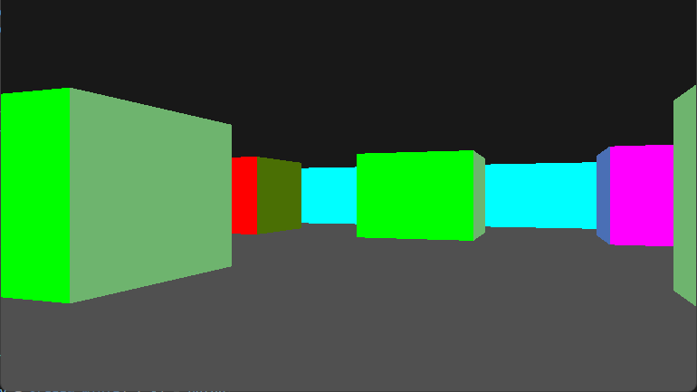

# Wolfenstein3D-like Renderer in SDL3

This project implements a basic 2D raycasting engine using SDL3 to render a first-person view of a grid-based world. The engine is inspired by concepts from the [Lodev Raycasting Tutorial](https://lodev.org/cgtutor/raycasting.html). It demonstrates raycasting fundamentals, player movement, and real-time frame updates.

## Buidling and Running

1. **Dependencies**: [SDL3](https://wiki.libsdl.org/SDL3/Installation), [CMake](https://cmake.org/download/)
2. **Compile**: make -S . -B build -DSDL3_DIR:<path_to_sdl_cmake_library>
3. Run **./DOOMA.exe**

# References
Lode's Computer Graphics Tutorial Raycasting - https://lodev.org/cgtutor/raycasting.html